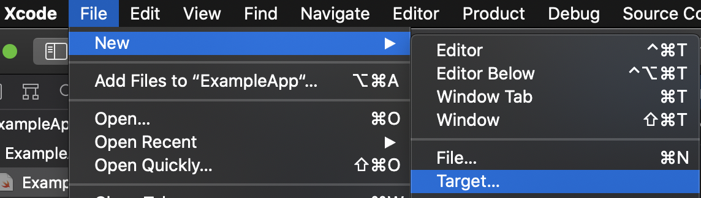

# :mage: Instruction for creating macOS Drivers 
Operational systems course project at UCU.

*Warning: instruction is unfinished.*

### :ukraine: For Ukrainian translation click [here](ukrainian_version.md)

---

## Table of contents
*Needs revision*

1. [Instruction](#instruction)
1. [Definitions](#definitions)
1. [Notions and acronyms](#notions-and-acronyms)
1. [Introduction to drivers](#introduction-to-drivers)
1. [Details on the task for macOS](#details-on-the-task-for-macos)
1. [macOS tools](#macos-tools)
    1. [More about I/O kit](#more-about-io-kit)
    1. [More about DriverKit](#more-about-driverkit)
1. [Drivers using DriverKit framework](#drivers-using-driverkit-framework)
    1. [Starting](#starting)
    1. [Building up the project](#building-up-the-project)
    1. [Information about the driver and matching](#information-about-the-driver-and-matching)
    1. [Installing Your driver](#installing-your-driver)
1. [Drivers using I/O Kit collection of frameworks](#drivers-using-io-kit-collection-of-frameworks)
1. [Sources/literature](#sourcesliterature)

---
# Instruction:
Let's get started and enter the magical world of the drivers creation, and May the Force be with You.

## Introduction:

### Definitions:
*coming soon...*

### Notions and acronyms:
* **Dext** – driver extension.
* **Kext** – kernel extension.
* **SDK** – Software Development Kit.
* **HID** - Human Interface Device.

### Introduction to drivers:
Essentially, a driver is a specific code, which controls a corresponding I/O device, attached to the computer [2]. 
In other words, drivers can be viewed as a bridge between computer peripherals and the rest of the system. [3] 
So, it is a mean of communication and control. 
 
Andrew Tanenbaum’s “Modern Operating Systems” [2] provide a good overview for the drivers, which run in the kernel 
space, but in this tutorial we will mostly focus on the drivers, which run in the user space. 

### Details on the task for macOS:
As told in Amit Singh's "Mac OS X Internals. A Systems Approach" [1], even though usually writing drivers can be considered
difficult, the macOS driver architecture is helpful in this regard. One of the most appealing advantages is that it
supports user space drivers (importance of which we will discuss a little later –– in the DriverKit section).

The book, mentioned above provides a great overview of drivers architecture and task of writing them for the macOS systems. 
Here I will include some of the details, that might be important for understanding, when only starting working with
drivers in general and macOS drivers in particular.

Usually, typical Unix systems use device special files (which reside in the /dev/ directory) for the user interface 
with devices. Newer systems (macOS included) also manage devices more dynamically –– 
they allow to dynamically create or delete (and automatically assign) these device files. 
macOS provides device files for storage devices, serial devices, pseudo-terminals, and several pseudo-devices.

*more to be added later...*

---
## macOS tools: 
In this instruction, we will discuss two possible options, regarding the choice of tools, when writing drivers for 
macOS systems. The first is the I/O kit –– a collection of frameworks libraries, tools, and other resources for 
creating device drivers, and the second is the DriverKit –– a modernized replacement of the I/O Kit.

### More about I/O kit:
The I/O Kit is a collection of both kernel-level and user-level software, that is used as a simplified driver 
development mechanism. The I/O Kit also coordinates the use of device drivers. [1]

When writing drivers for macOS using I/O Kit, the drivers is essentially an I/O Kit object, which manages a specific
piece of hardware. [1]

### More about DriverKit:
*Information about DriverKit is retrieved from and based on the official presentation of the kit, available by the 
following [link](https://developer.apple.com/videos/play/wwdc2019/702/) and on the 
[official documentation](https://developer.apple.com/documentation/driverkit).* 

DriverKit is an SDK, which was introduced during the Worldwide Developers Conference in 2019 along with System 
Extensions. All DriverKit frameworks are based on the I/O Kit, but they were modernized to be more reliable, 
secure, and comfortable for development. DriverKit is used to build Driver Extensions (dexts) in the user space. 

Driver extensions are built using DriverKit, they are now a replacement for I/O Kit device drivers.

They are used to control the following devices:
* USB
* Serial
* NIC (Network Interface Controller)
* HID (Human Interface Device)

As described in the video by the following [link](https://developer.apple.com/videos/play/wwdc2019/702/) 
there are several advantages to using System Extensions and DriverKit:
* Unlike kexts, System Extensions run in the user space, bugs in them cannot compromise the kernel
* System Extensions have no restrictions on dynamic memory allocation, synchronization, and latency
* Building, testing, and debugging can all be performed on one machine
* Enabled full debugger support
* There is no need to restart the machine if the extension crushes
* Kernel and other applications will not stop running if the extension crushes
* DriverKit provides full modern replacement of the previously discussed I/O kit 
* DriverKit drivers run in user space, where, just like System Extensions, they cannot compromise kernel and shutter the security 
* These extensions are available to all the users, even for tasks, previously performed only by kexts
* Et cetera

Furthermore, starting with new versions of macOS, kexts will be deprecated. 
It is [officially stated](https://developer.apple.com/documentation/iokit/) by the Apple developer website, 
that devices supported on macOS 11 and later require DriverKit instead of I/O Kit. 

We will try the newer, more secure, and, perhaps, an easier approach –– DriverKit framework.

---
##  Drivers using DriverKit framework –– about:

### Driver structure:

### Class hierarchy:

### C++ subset:

### Briefly about communication with kernel:

---
## Drivers using DriverKit framework –– example:
*This –– the first version of the instruction –– is based on the 
[official guidelines](https://developer.apple.com/documentation/driverkit/creating_a_driver_using_the_driverkit_sdk) [3]
for writing drivers with DriverKit SDK and the sample code [5].* 

### Starting:
To start a project, we will create it in the Xcode, which provides a base template for creating DriverKit drivers.

We will add the driver to a pre-existing project, because drivers, created with DriverKit require an app to install and 
to use them.

Start with creating a new app in the Xcode:


P.S. You can choose another name, which You would prefer, and specify Your organization identifier.

Using Swift for the app (driver itself will be written using C++) like in the official documentation:


Now, we will add driver to the project:



Choose a DriverKit driver:


Choose options:


Now You should be able to see a somewhat similar window:


Congratulation! We are *almost* done.

### Building up the project:
Let's try to build a basic keyboard driver using the template we obtained just now and explore it at the same time. 
For this task we will use parts of code from the official apple documentation [3].

Firstly, what do we have in the template for the driver creation? Take a look at the directory, 
which is called the same way as Your project itself:


* ***.cpp** –– is a file with main C++ source file.
* ***.iig** –– is an IOKit interface generator header file. 
* ***.entitlements** –– is  a default entitlements file. We will discuss what are entitlements. 
and how to populate that file in the next section.
* ***.plist** –– is a file with specific information to support the loading and installation of the driver.

Let's begin to go through code of the Keyboard device from the documentation.
Firstly, let's check out contents of the *.iig file (DriverExample.iig in my case):
```c++
#ifndef DriverExample_h
#define DriverExample_h

#include <Availability.h>
#include <DriverKit/IOService.iig>

class DriverExample: public IOService
{
public:
    virtual kern_return_t
    Start(IOService * provider) override;
};

#endif /* DriverExample_h */
```
It will look just like that. *(Note that this information applies on the November 13th of 2021, 
and there can be slight changes of API in the millennia You currently live in)*

Here, ```IOService``` –– is a a base class of all the drivers. We can continue working with it, but it would be better to 
work with something more specific. There are different families of classes, provided by the DriverKit and for our case 
we will choose a class for handling HID events. Why exactly HID (Human Interface Device)? It is because keyboard belongs 
to such devices and we want a class to somehow obtain information on what happens with it. The exact class we would
choose instead of the base one is the ```IOUserHIDEventService```.

That is how class in Your *.iig file should look like now (plus the new additional include):
```c++
#include <HIDDriverKit/IOUserHIDEventService.iig>

class DriverExample: public IOUserHIDEventService
{
public:
    virtual kern_return_t
    Start(IOService * provider) override;
};
```

We will also need to implement some init and free methods, so we will now add them to header file, too. 
That is how the whole file should look like now:
```c++
#ifndef DriverExample_h
#define DriverExample_h

#include <Availability.h>
#include <DriverKit/IOService.iig>
#include <HIDDriverKit/IOUserHIDEventService.iig>

class DriverExample: public IOUserHIDEventService
{
public:
    virtual bool init() override;
    virtual void free() override;
    
    virtual kern_return_t
    Start(IOService * provider) override;
};

#endif /* DriverExample_h */
```

Now let's move on to our main source code file –– Your *.cpp file (DriverExample.cpp in my case). It should currently 
look like that:
```c++
#include <os/log.h>

#include <DriverKit/IOUserServer.h>
#include <DriverKit/IOLib.h>

kern_return_t
IMPL(DriverExample, Start)
{
    kern_return_t ret;
    ret = Start(provider, SUPERDISPATCH);
    os_log(OS_LOG_DEFAULT, "Hello World");
    return ret;
}
```

To work with a HID service we need some more includes, so let's add them:
```c++
#include <DriverKit/OSCollections.h>
#include <HIDDriverKit/HIDDriverKit.h>
```

When the system will instantiate your driver's service class, it will call its init method. Let's add code of this method: 
```c++
struct DriverExample_IVars
{
    OSArray *elements;
    
    struct {
        OSArray *elements;
    } keyboard;
};


bool DriverExample::init()
{
    if (!super::init()) {
        return false;
    }
    
    ivars = IONewZero(DriverExample_IVars, 1);
    if (!ivars) {
        return false;
    }
    
exit:
    return true;
}
```
(This code goes after the ```#include "YouProjectName.h"``` and before the implementation of the start of the service)

Here, during initialization time we allocate space for the driver's variables –– 
elements and a keyboard (that contains elements) in our case 
(here You can see variables in the ```DriverExample_IVars``` structure). 

So, following this example, You would need to define a structure with variables, that You driver requires and
and allocate this structure in the ```init()``` method.

We allocated instance variables for the keyboard driver, so now we need a method to free the memory from them
(further examples of code are from/based on code from [5]):
```c++
void DriverExample::free()
{
    if (ivars) {
        OSSafeReleaseNULL(ivars->elements);
        OSSafeReleaseNULL(ivars->keyboard.elements);
    }
    
    IOSafeDeleteNULL(ivars, DriverExample_IVars, 1);
    super::free();
}
```
This ```free()``` method will be called before unloading our service.

Now, let's start organizing our ```Start``` method:
```c++
kern_return_t
IMPL(DriverExample, Start)
{
   kern_return_t ret;
    
   ret = Start(provider, SUPERDISPATCH);
   if (ret != kIOReturnSuccess) {
      Stop(provider, SUPERDISPATCH);
      return ret;
   }
   
   //
   // Here the code of the startup tasks will go
   //

   RegisterService();
    
   return ret;
}
```
This method will be called, when the system will be ready to process information from the device.

In this method driver performs all the various start up tasks: variables initializations, changing device settings,
allocating memory for data buffers, et cetera.

Now let's add some start up tasks to the code. This code is based on the sample from [5].
```c++
kern_return_t
IMPL(DriverExample, Start)
{
    kern_return_t ret;
    
    ret = Start(provider, SUPERDISPATCH);
    if (ret != kIOReturnSuccess) {
        Stop(provider, SUPERDISPATCH);
        return ret;
    }

    os_log(OS_LOG_DEFAULT, "Hello from Your first DriverKit driver!");
    
    ivars->elements = getElements();
    if (!ivars->elements) {
        os_log(OS_LOG_DEFAULT, "Failed to get elements");
        Stop(provider, SUPERDISPATCH);
        return kIOReturnError;
    }
    
    ivars->elements->retain();

    os_log(OS_LOG_DEFAULT, "The startup task is now finished.");
    
    RegisterService();
    
    return ret;
}
```
To actually work with data from the keyboard, You would also need to parse arguments after retaining them. Parsing
sample code is also available at [5].


Congratulations! That is actually Your first DriverKit driver! Even though it doesnt really do anything with data 
from the keyboard (it just retains it) it is, nevertheless, a driver. 
Yet it is not The End –– in order to run that driver You need to perform some more, less code-oriented, steps.

### Information about the driver and matching:
*more details coming soon...*

In short, the plist file, which is located in the Xcode project, 
is used so that the system can understand for which device this driver is suitable. 
That is, when the system looks for a driver to use for a particular device, 
it will check whether the information from this file is appropriate for the device, or not.

### Entitlements
*more details coming soon...*

In order for driver to interact with devices and services, You are required to request 
the entitlement for DriverKit development from Apple.

The system loads only drivers, which that have a valid set of entitlements, that is why You cannot develop a complete product without them. 
The DriverKit entitlements give your driver permission to run as a driver and define the type of hardware Your driver supports.

To perform  installation, your app must have the System Extension entitlement. 

To request entitlement:
1. Go to https://developer.apple.com/system-extensions/ and follow the link to request an entitlement.
2. Apply for the DriverKit entitlement.
3. Provide a description of the apps you’ll use.

### Installing Your driver:
*Based on guidelines and recommendations from [6].*

Now that we have our own little driver we might want to test it and use it. In order to do the we first need to
install and activate our driver.

The thing is –– all the drivers come with an app, and for DriverKit having an app is a requirement. So we don't just 
install drivers, we install them from the corresponding app.

In the [Starting](#starting) section before creating a driver we first create an app project, and now we 
will focus on it.

The example in [examples/HandlingKeyboardEventsFromAHumanInterfaceDevice](examples/HandlingKeyboardEventsFromAHumanInterfaceDevice) 
provides full code for the Swift app and code for the driver (partly discussed previously).

Lets see which part of app is related to the driver:
```
// Activate the driver.
let request = OSSystemExtensionRequest.activationRequest(forExtensionWithIdentifier: driverID, queue: DispatchQueue.main)
request.delegate = self
let extensionManager = OSSystemExtensionManager.shared
extensionManager.submitRequest(request)
```

This part of code is used to activate Your driver and it can be found in [AppDelegate.swift](examples/HandlingKeyboardEventsFromAHumanInterfaceDevice/HIDKeyboardApp/AppDelegate.swift).

Now You can launch Your app and install the driver. 

But what if You dont have entitlements from Apple, but still want to install the driver? 
Visit the following, “debug” section.

### Debug 
If You try to install driver in a “safe mode” (with enabled SIP, should be usual state of Your machine) 
without entitlements, discussed previously, You will get a following error:


That's why, if You did not receive entitlements and just want to practice and debug Your driver 
(or system extension, it will work for them, too) You should enter a developer mode and disable SIP. 
To achieve this, perform following steps.

To enable developer mode in terminal enter the following command:
```
systemextensionsctl developer on 
```
There might occur the following problem: 


It means that You have enabled SIP (System Integrity Protection).

To disable it follow next steps (from article [Disabling and Enabling System Integrity Protection](https://developer.apple.com/documentation/security/disabling_and_enabling_system_integrity_protection)):

*(Although, before disabling the SIP, i would recommend to create a Time Machine and save in an external storage. 
I recommend it for security reasons –– You might forget to turn the SIP back on and Your machine will possibly 
be exposed to malicious code, etc.)*

Firstly, enter the Recovery mode. In order to do it, press COMMAND and R just when turning on Your machine. 
After entering the Recovery mode, go to utilities and choose Terminal. In this Terminal run the following command:
```
csrutil disable
```

Now restart the machine, in order for changes to be performed.

Now after entering developer mode You should see the following message:


Now, running the app should not be a problem, and You will be able to debug the driver properly.

*Important: Currently in my case a problem occurred with developer team, I am using a private team and I cannot build 
the driver even in developer mode, so I am currently working on resolving this problem. With that said, following 
tutorial should work well in theory, but it lacks practical examples. If I will be able to find a solution to my problem,
I will include it here (because, it seems to me, that enrolling in the Apple Developer Program might an overkill
for someone, who is just testing DriverKit as a hobby and/or education).*

If You would like to run app from the terminal You can try following way (run from the directory, which contains the 
project, for example [this one](examples/HandlingKeyboardEventsFromAHumanInterfaceDevice)):
```
/usr/bin/xcodebuild -target HIDKeyboardApp  -configuration Debug
```

If there is a problem with running x-code like this, You might try the following fix (it will use the Xcode app):
```
sudo xcode-select -s /Applications/Xcode.app/Contents/Developer
```

To check list of the extensions (and hopefully see Your driver here) in terminal enter the following command:
```
systemextensionsctl list
```

In order to debug Your program ([Debugging and Testing System Extensions](https://developer.apple.com/documentation/driverkit/debugging_and_testing_system_extensions)) 
use lldb. To obtain PID of You process use ```ps```. Run lldb from the Terminal, and attach to the process  ```process attach --pid```.
Now You should be able to debug Your program.

After You are finished remember to exit the developer mode and **enable SIP!**

To disable developer mode simply run the following command:
```
systemextensionsctl developer off
```

System Integrity Protection is extremely important to ensure that any malicious code doesn't damage Your system, 
so enter the Recovery mode once again, enter the terminal and enable SIP by running the following command:
```
csrutil enable
```

Now restart the machine, in order for changes to be performed.

That is it, now You have both Your app and driver debugged and ready for further adventures.

---
## Additionaly:

---

## Sources/literature:
1. "MAC OS X Internals: A Systems Approach" by Amit Singh ([link](https://www.oreilly.com/library/view/mac-os-x/0321278542/))
2. Modern Operating Systems, Andrew S. Tanenbaum (mostly chapter 5) ([link](https://csc-knu.github.io/sys-prog/books/Andrew%20S.%20Tanenbaum%20-%20Modern%20Operating%20Systems.pdf))
3. [Creating a Driver Using the DriverKit SDK](https://developer.apple.com/documentation/driverkit/creating_a_driver_using_the_driverkit_sdk) 
4. [System Extensions and DriverKit video presentation](https://developer.apple.com/videos/play/wwdc2019/702/)
5. [Handling Keyboard Events from a Human Interface Device](https://developer.apple.com/documentation/hiddriverkit/handling_keyboard_events_from_a_human_interface_device)
6. [Installing System Extensions and Drivers](https://developer.apple.com/documentation/systemextensions/installing_system_extensions_and_drivers)
7. [DriverKit](https://developer.apple.com/documentation/driverkit)
8. [Implementing Drivers, System Extensions, and Kexts](https://developer.apple.com/documentation/systemextensions/implementing_drivers_system_extensions_and_kexts)
9. [Introduction to I/O Kit Fundamentals](https://developer.apple.com/library/archive/documentation/DeviceDrivers/Conceptual/IOKitFundamentals/Introduction/Introduction.html)
10. [Preparing the Development Team](https://developer.apple.com/library/archive/documentation/General/Conceptual/ApplicationDevelopmentOverview/CreateYourDevelopmentTeam/CreateYourDevelopmentTeam.html)
11. [Non-macOS driver template example (Oracle)](https://docs.oracle.com/cd/E36784_01/html/E36866/eqbof.html#scrolltoc)

## Arranged by:
* [Daria Omelkina](https://github.com/dariaomelkina)

Special Thanks go to everyone on the Apple team who created instruments, discussed in this example, 
documentation for them and code samples, and made everything available on the web.
