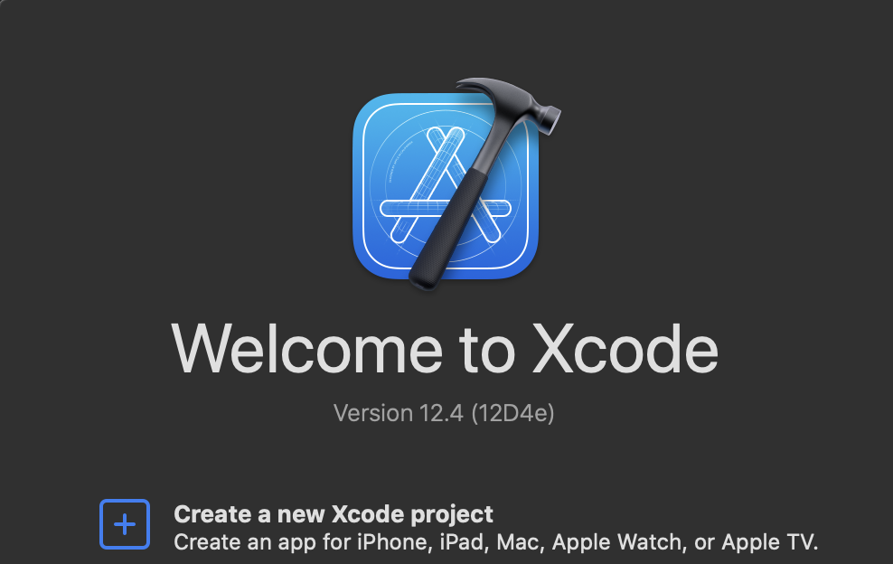
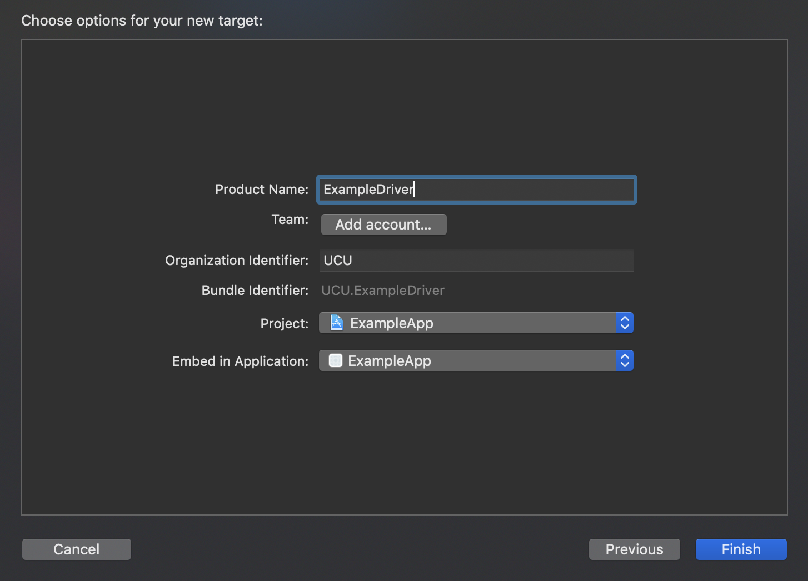
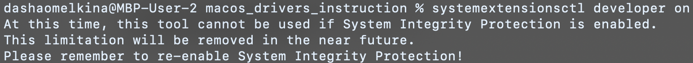

# :mage: Інструкція з написання драйверів для MacOS
Семестровий проєкт з курсу Операційних систем в УКУ.

*Обережно: інструкція незавершена.*

### :uk: Для перегляду англійської версії перейдіть за наступним [посиланням](README.md)

# Інструкція:
Давайте розпочнемо і увійдемо в чарівний світ створення драйверів, і may the force be with You.

## Анотації:
*незабаром...*

## Поняття та акроніми:
* **Dext** – розширення драйвера.
* **Kext** – розширення ядра.
* **SDK** – Комплект розробки програмного забезпечення.
* **HID** – стандарт human interface device.

## Вступ у світ драйверів:
По суті, драйвер — це специфічний код, який керує відповідним пристроєм введення-виведення, підключеним до комп’ютера [2].
Іншими словами, драйвери можна розглядати як міст між периферійними пристроями комп’ютера та рештою системи. [3]
Отже, це засіб комунікації та контролю.
 
«Сучасні операційні системи» Ендрю Таненбаума [2] надають хороший огляд драйверів, які запускаються в просторі ядра, 
але в цій інструкції ми здебільшого зосередимося на драйверах, які запускаються в просторі користувача.

## Деталі завдання для macOS:
Як сказано в роботі Аміта Сінгха «Mac OS X Internals. A Systems Approach» [1], 
хоч зазвичай написання драйверів можна вважати важкою задачею, 
архітектура драйвера macOS є доволі корисною в цьому плані. 
Однією з основних переваг є те, що вона підтримує драйвери в просторі користувача 
(важливість чого ми обговоримо трохи пізніше –– у розділі про DriverKit).

У згаданій вище книзі наведено чудовий огляд архітектури драйверів і опис самого завдання їх написання для систем macOS.
В цю інструкцію я додала деякі деталі, які можуть бути важливими для розуміння, коли тільки починаєш працювати
з драйверами загалом і драйверами macOS зокрема.

Зазвичай типові системи Unix використовують спеціальні файли пристрою (які зазвичай знаходяться в директорії /dev/)
для інтерфейсу комунікації користувача з пристроями. Новіші системи (включаючи macOS) ще й динамічніше керують пристроями ––
вони дозволяють динамічно створювати або видаляти (і автоматично призначати) ці файли пристроям.
macOS надає ці файли для пристроїв зберігання даних, послідовних (serial) пристроїв, псевдотерміналів і деяких псевдопристроїв.

*більше інформації пізніше...*

## Інструменти для macOS:
У цій інструкції ми обговоримо два можливі варіанти щодо вибору інструментів при написанні драйверів для
системи macOS. Перший – це I/O Kit – набір бібліотек фреймворків, інструментів та інших ресурсів для
створення драйверів пристроїв, а другий – DriverKit – модернізована заміна I/O Kit.

## Детальніше про I/O Kit:
I/O Kit — це набір програмного забезпечення як на рівні ядра, так і на рівні користувача, 
який використовується як спрощений засіб для написання драйверів. 
I/O Kit також координує використання драйверів пристроїв. [1]

Під час написання драйверів для macOS за допомогою I/O Kit драйвери, по суті, є об’єктами I/O Kit, який керує певним
частина обладнання. [1] 

## Більше про DriverKit:
*Інформацію про DriverKit отримано з офіційної презентації, доступної на
за посиланням (https://developer.apple.com/videos/play/wwdc2019/702/) і в
[офіційній документації](https://developer.apple.com/documentation/driverkit).*

DriverKit — це SDK, який був представлений під час Worldwide Developers Conference у 2019 році разом із System Extensions. 
Усі фреймворки DriverKit засновані на I/O Kit, але вони були модернізовані, щоб бути більш надійними,
безпечними та зручнішими для розробки. 
DriverKit використовується для створення розширень драйверів (dexts -- driver extensions) у просторі користувача.

Тепер розширення драйверів, створені за допомогою DriverKit, замінюють драйвери створені з I/O Kit.

Ці драйвери використовуються для управління наступними приладами:
* USB
* Послідовними (serial)
* NIC (Network Interface Controller)
* HID (Human Interface Device)

Як описано у відео за наступним [посиланням](https://developer.apple.com/videos/play/wwdc2019/702/)
є кілька переваг використання System Extensions і DriverKit:
* На відміну від kexts, системні розширення виконуються в просторі користувача, помилки в них не можуть пошкодити ядру
* Системні розширення не мають обмежень щодо динамічного розподілу пам'яті, синхронізації та затримки
* Білд, тестування та дебаг можна виконувати на одній машині
* Увімкнено повну підтримку дебагеру
* Тепер немає необхідності перезапускати машину, якщо розширення ламається
* Ядро та інші програми не зупиняться, якщо розширення зламається
* DriverKit забезпечує повну сучасну заміну попередньо обговорюваного I/O Kit
* Драйвери DriverKit працюють у просторі користувача, де, як і System Extensions, вони не можуть нести небезпеки для ядра
* Ці розширення доступні всім користувачам, навіть для завдань, які раніше виконували лише kexts
* І так далі і тому подібне

Крім того, починаючи з нових версій macOS, kexts будуть ваважати застарілими.
Це [офіційно зазначено] (https://developer.apple.com/documentation/iokit/) на веб-сайті розробників Apple,
що пристрої, які підтримуються для macOS 11 (і новіших версій), потребують DriverKit замість I/O Kit.

Ми спробуємо цей новий, безпечніший і, можливо, простіший підхід – фреймворк DriverKit.

---

## Створення драйверів з DriverKit:
*Ця –– перша версія інструкції –– базується на
[офіційній інструкції](https://developer.apple.com/documentation/driverkit/creating_a_driver_using_the_driverkit_sdk) [3]
для написання драйверів за допомогою DriverKit SDK та зразка коду [5].*

## Початок:
Щоб розпочати проєкт, ми створимо його в Xcode, який надає базовий шаблон для створення драйверів DriverKit.

Ми додамо драйвер до вже існуючого проєкту, оскільки драйвери, створені за допомогою DriverKit, 
вимагають застосунку (Swift app наприклад), який встановить ці драйвери та використовуватиме їх.

Почніть зі створення нової програми в Xcode:




P.S. Ви можете вибрати іншу назву, якій ви віддаєте перевагу, та вказати ідентифікатор вашої організації.

Ми використаємо Swift для написання застосунку (сам драйвер буде написаний на C++), як в офіційній документації:


Тепер ми додамо драйвер до проекту:


Виберіть драйвер DriverKit:


Виберіть опції:



Тепер ви зможете побачити дещо схоже вікно:


Вітаю! Ми *майже* закінчили.

## Білд проекту:
Давайте спробуємо створити базовий драйвер клавіатури, використовуючи шаблон, який ми щойно отримали, 
і в той же час дослідити його.
Для цього завдання ми будемо використовувати частини коду з офіційної документації Apple [3].

По-перше, що саме ми маємо в шаблоні для створення драйвера? Подивіться на директорію,
яка називається так само, як і сам проект:


* ***.cpp** –– це файл із основним вихідним кодом C++.
* ***.iig** –– це файл-заголовок генератора інтерфейсу IOKit.
* ***.entitlements** –– є файлом entitlements (прав) за замовчуванням. Ми обговоримо, що таке entitlements (права)
і як заповнити цей файл у наступному розділі.
* ***.plist** –– це файл із конкретною інформацією для підтримки завантаження та встановлення драйвера.

Давайте почнемо перегляд коду пристрою клавіатури з документації.
По-перше, давайте перевіримо вміст файлу *.iig (DriverExample.iig у моєму випадку):
```c++
#ifndef DriverExample_h
#define DriverExample_h

#include <Availability.h>
#include <DriverKit/IOService.iig>

class DriverExample: public IOService
{
public:
    virtual kern_return_t
    Start(IOService * provider) override;
};

#endif /* DriverExample_h */
```
Код буде виглядати якось так. *(Зверніть увагу, що ця інформація є актуальною на 13 листопада 2021 року,
і можуть відбутися незначні зміни API в тому тисячоліття, в якому ви зараз живете)*

Тут ```IOService``` –– це базовий клас усіх драйверів. Ми можемо продовжувати з ним працювати, але було б краще
працювати з чимось більш конкретним. Існують різні сімейства класів, надані DriverKit, і для нашого випадку
ми виберемо клас для обробки подій HID. Чому саме HID (Human Interface Device)? Це тому, що клавіатура належить
до таких пристроїв, і ми хочемо, щоб клас якимось чином отримував інформацію про те, що з ним відбувається. 
Конкретний клас, який ми виберемо замість базового -– ```IOUserHIDEventService```.

Ось як зараз має виглядати клас у вашому файлі *.iig (плюс нові додаткові інклюди):
```c++
#include <HIDDriverKit/IOUserHIDEventService.iig>

class DriverExample: public IOUserHIDEventService
{
public:
    virtual kern_return_t
    Start(IOService * provider) override;
};
```

Нам також потрібно буде реалізувати кілька init та free методів, тому ми також додамо їх до файлу-заголовку.
Ось як тепер має виглядати весь файл:
```c++
#ifndef DriverExample_h
#define DriverExample_h

#include <Availability.h>
#include <DriverKit/IOService.iig>
#include <HIDDriverKit/IOUserHIDEventService.iig>

class DriverExample: public IOUserHIDEventService
{
public:
    virtual bool init() override;
    virtual void free() override;
    
    virtual kern_return_t
    Start(IOService * provider) override;
};

#endif /* DriverExample_h */
```

Тепер перейдемо до нашого основного файлу вихідного коду – вашого файлу *.cpp (DriverExample.cpp у моєму випадку). 
Наразі він має виглядати так:
```c++
#include <os/log.h>

#include <DriverKit/IOUserServer.h>
#include <DriverKit/IOLib.h>

kern_return_t
IMPL(DriverExample, Start)
{
    kern_return_t ret;
    ret = Start(provider, SUPERDISPATCH);
    os_log(OS_LOG_DEFAULT, "Hello World");
    return ret;
}
```

Для роботи з HID service нам потрібні ще деякі інклюди, тому давайте додамо їх:
```c++
#include <DriverKit/OSCollections.h>
#include <HIDDriverKit/HIDDriverKit.h>
```

Коли система створить екземпляр service class'у вашого драйвера, вона викличе метод init. Додамо код цього методу:
```c++
struct DriverExample_IVars
{
    OSArray *elements;
    
    struct {
        OSArray *elements;
    } keyboard;
};


bool DriverExample::init()
{
    if (!super::init()) {
        return false;
    }
    
    ivars = IONewZero(DriverExample_IVars, 1);
    if (!ivars) {
        return false;
    }
    
exit:
    return true;
}
```
(Цей код йде після ```#include "YouProjectName.h"``` і перед реалізацією Start)

Тут під час ініціалізації ми виділяємо місце для змінних драйвера ––
елементів і клавіатури (яка містить елементи) у нашому випадку
(тут Ви можете побачити змінні в структурі ```DriverExample_IVars```).

Отже, дотримуючись цього прикладу, вам потрібно буде визначити структуру зі змінними, які вимагає ваш драйвер і
і алокувати пам'ять для цієї структури в методі ```init()```.

Ми виділили змінні екземпляра для драйвера клавіатури, тому тепер нам потрібен метод для звільнення пам’яті від них
(подальші приклади коду взято з/базуються на коді з [5]):
```c++
void DriverExample::free()
{
    if (ivars) {
        OSSafeReleaseNULL(ivars->elements);
        OSSafeReleaseNULL(ivars->keyboard.elements);
    }
    
    IOSafeDeleteNULL(ivars, DriverExample_IVars, 1);
    super::free();
}
```

Цей метод ```free()``` буде викликано перед вивантаженням (unloading) нашого сервісу.

Тепер давайте почнемо імплементовувати наш метод ```Start```:
```c++
kern_return_t
IMPL(DriverExample, Start)
{
   kern_return_t ret;
    
   ret = Start(provider, SUPERDISPATCH);
   if (ret != kIOReturnSuccess) {
      Stop(provider, SUPERDISPATCH);
      return ret;
   }
   
   //
   // Here the code of the startup tasks will go
   //

   RegisterService();
    
   return ret;
}
```

Цей метод буде викликаний, коли система буде готова до обробки інформації з пристрою.

У цьому методі драйвер виконує всі різноманітні завдання запуску: ініціалізацію змінних, зміну налаштувань пристрою,
виділення пам'яті для буферів даних і так далі.

Тепер давайте додамо кілька початкових завдань до коду. Цей код базується на зразку з [5].
```c++
kern_return_t
IMPL(DriverExample, Start)
{
    kern_return_t ret;
    
    ret = Start(provider, SUPERDISPATCH);
    if (ret != kIOReturnSuccess) {
        Stop(provider, SUPERDISPATCH);
        return ret;
    }

    os_log(OS_LOG_DEFAULT, "Hello from Your first DriverKit driver!");
    
    ivars->elements = getElements();
    if (!ivars->elements) {
        os_log(OS_LOG_DEFAULT, "Failed to get elements");
        Stop(provider, SUPERDISPATCH);
        return kIOReturnError;
    }
    
    ivars->elements->retain();

    os_log(OS_LOG_DEFAULT, "The startup task is now finished.");
    
    RegisterService();
    
    return ret;
}
```

Щоб працювати з даними з клавіатури, вам також потрібно буде розпарсити аргументи після їх збереження. 
Зразок коду парсингу також доступний у [5].

Вітаю! Це (мабуть) ваш перший драйвер DriverKit! Хоча він насправді нічого не робить з даними
з клавіатури (він просто зберігає її) це, тим не менш, драйвер.
Але це не Кінець –– для того, щоб запустити цей драйвер, Вам потрібно виконати ще деякі кроки.

## Інформація про драйвер і метчінг:
*детальніша інформація незабаром...*

Якщо коротко, файл plist, який знаходиться в проекті Xcode,
використовується для того, щоб система могла зрозуміти, для якого пристрою підходить цей драйвер.
Тобто, коли система шукає драйвер для певного пристрою,
вона перевірить, чи підходить інформація з цього файлу для пристрою, чи ні.

## Права (entitlements)
*детальніша інформація незабаром...*

Для того, щоб драйвер міг взаємодіяти з пристроями та сервісами, вам потрібно запросити
права на розробку DriverKit у Apple.

Система завантажує лише драйвери, які мають валідний набір прав, тому без них неможливо розробити повний продукт.
Права DriverKit дають вашому драйверу дозвіл працювати як драйвер (перепрошую за тавтологію) і визначають тип обладнання, 
яке підтримує ваш драйвер.

Щоб виконати інсталяцію драйвера, ваша програма повинна мати права на для System Extensions.

Щоб подати запит на отримання цих прав:
1. Перейдіть на сторінку https://developer.apple.com/system-extensions/ і перейдіть за відповідним посиланням, щоб надіслати запит на отримання прав.
2. Подайте заявку на отримання прав DriverKit.
3. Надайте опис програм, які ви будете використовувати в проєкті.

## Інсталяція драйвера:
*На основі вказівок та рекомендацій з [6].*

Тепер, коли у нас є власний невеличкий драйвер, ми, можливо, захочемо його протестувати та й використовувати. 
Для того, щоб зробити це, нам спочатку потрібно інсталювати та активувати наш драйвер.

Справа в тому, що всі драйвери надаються разом із застосунком, і для DriverKit наявність застосунку (програми) 
є обов’язковою умовою. Тому ми не встановлюємо драйвери просто так, ми встановлюємо їх із відповідної програми.

У розділі [Starting](#starting) перед створенням драйвера ми спочатку створюємо проєкт застосунку, тепер ми
зосередиться на цьому.

Надалі приклад стосуватиметься проєкту, наданого в якості зразку компанією Apple за наступним посиланням –– 
https://developer.apple.com/documentation/hiddriverkit/handling_keyboard_events_from_a_human_interface_device.

Приклад у [examples/HandlingKeyboardEventsFromAHumanInterfaceDevice](examples/HandlingKeyboardEventsFromAHumanInterfaceDevice)
надає повний код для програми, написаної на Swift, і код для драйвера (це частково обговорювалося раніше).

Тож давайте подивимося, яка частина програми пов’язана з запуском драйвера:
```
// Activate the driver.
let request = OSSystemExtensionRequest.activationRequest(forExtensionWithIdentifier: driverID, queue: DispatchQueue.main)
request.delegate = self
let extensionManager = OSSystemExtensionManager.shared
extensionManager.submitRequest(request)
```

Ця частина коду використовується для активації вашого драйвера, і її можна знайти в 
[AppDelegate.swift](examples/HandlingKeyboardEventsFromAHumanInterfaceDevice/HIDKeyboardApp/AppDelegate.swift).

Тепер ви можете запустити свою програму та встановити драйвер.

Але що робити, якщо ви не маєте прав (entitlements) від Apple, але все одно хочете встановити драйвер?
Про це йтиметься в наступному розділі –– «Дебаг».

## Дебаг 
Якщо ви спробуєте встановити драйвер у «безпечному режимі» (з увімкненим SIP, загалом це має бути звичайний стан вашого комп'ютера)
без прав (entitlements), обговорюваних раніше, ви отримаєте таку помилку:


Ось чому, якщо ви не отримали прав і просто хочете потренуватися та відлагодити свій драйвер
(або системне розширення, їх це також стосується) Вам слід увійти в режим розробника та відключити SIP.
Щоб зробити це, виконайте наступні дії:

Щоб увімкнути режим розробника в терміналі, введіть таку команду:
```
systemextensionsctl developer on 
```

Тут може виникнути така проблема:




Це означає, що Ви маєте увімкнений SIP (захист цілісності системи).

Щоб вимкнути його, виконайте наступні кроки (зі статті [Вимкнення та ввімкнення захисту цілісності системи](https://developer.apple.com/documentation/security/disabling_and_enabling_system_integrity_protection)):

*(Хоча перед тим, як вимкнути SIP, я б рекомендувала створити так звану Машину Часу (Time Machine) та зберегти на зовнішньому носії.
Я рекомендую це з міркувань безпеки –– Ви можете забути знову ввімкнути SIP, і ваш комп’ютер, 
можливо, буде уразливим до шкідливого коду тощо)*

Спочатку увійдіть в режим Recovery. Щоб це зробити, натисніть COMMAND і R відразу під час увімкнення комп'ютера.
Після входу в режим Recovery перейдіть до утиліт і виберіть «Термінал». У цьому терміналі запустіть таку команду:
```
csrutil disable
```

Тепер перезапустіть комп'ютер, щоб зміни відбулися.

Тепер після входу в режим розробника ви повинні побачити таке повідомлення:


Тепер запуск програми не повинен бути проблемою, і ви зможете віддебажити драйвер.

*Важливо: наразі в моєму випадку виникла проблема з developer team, я використовую приватну команду і не можу створювати
драйвер навіть у режимі розробника, тому я зараз працюю над вирішенням цієї проблеми. З урахуванням сказаного, наступні 
інструкції повинні добре працювати в теорії, але в них бракує практичних прикладів. Якщо я зможу знайти рішення своєї проблеми,
я додам це сюди (тому що, як мені здається, реєстрація в Apple Developer Program може бути оверкілом
для тих, хто просто тестує DriverKit як хобі та/або для навчання).*

Якщо Ви хочете запустити програму з терміналу, ви можете спробувати наступним чином (запустити з диреторії, який містить
проєкт, наприклад [з цієї](examples/HandlingKeyboardEventsFromAHumanInterfaceDevice)):
```
/usr/bin/xcodebuild -target HIDKeyboardApp  -configuration Debug
```

Якщо є проблема із запуском xcode таким чином, ви можете спробувати такий фікс (воно використовуватиме програму Xcode):
```
sudo xcode-select -s /Applications/Xcode.app/Contents/Developer
```

Щоб перевірити список розширень (і, сподіваюся, побачити тут ваш драйвер) у терміналі, введіть таку команду:
```
systemextensionsctl list
```

Щоб налагодити вашу програму ([Налагодження та тестування системних розширень](https://developer.apple.com/documentation/driverkit/debugging_and_testing_system_extensions))
використовуйте lldb. Щоб отримати PID вашого процесу, використовуйте ```ps```. Запустіть lldb з терміналу та приєднайтесь до процесу ```process attach --pid```.
Тепер ви зможете віддебажити свою програму.

Після завершення не забудьте вийти з режиму розробника та **увімкнути SIP!**

Щоб вимкнути режим розробника, просто виконайте таку команду:
```
systemextensionsctl developer off
```

System Integrity Protection надзвичайно важливе, щоб гарантувати, що якийсь шкідливий код не пошкодить Вашу систему,
тому увійдіть у режим Recovery ще раз, увійдіть в Термінал та увімкніть SIP, виконавши таку команду:
```
csrutil enable
```

Тепер перезапустіть комп'ютер, щоб зміни були виконані.

Ось і все, тепер у вас і ваш застосунок, і драйвер, вони налагоджені та готові до подальших пригод.

---

## Джерела/література:
1. "MAC OS X Internals: A Systems Approach" by Amit Singh ([link](https://www.oreilly.com/library/view/mac-os-x/0321278542/))
2. Modern Operating Systems, Andrew S. Tanenbaum (mostly chapter 5) ([link](https://csc-knu.github.io/sys-prog/books/Andrew%20S.%20Tanenbaum%20-%20Modern%20Operating%20Systems.pdf))
3. [Creating a Driver Using the DriverKit SDK](https://developer.apple.com/documentation/driverkit/creating_a_driver_using_the_driverkit_sdk) 
4. [System Extensions and DriverKit video presentation](https://developer.apple.com/videos/play/wwdc2019/702/)
5. [Handling Keyboard Events from a Human Interface Device](https://developer.apple.com/documentation/hiddriverkit/handling_keyboard_events_from_a_human_interface_device)
6. [Installing System Extensions and Drivers](https://developer.apple.com/documentation/systemextensions/installing_system_extensions_and_drivers)
7. [DriverKit](https://developer.apple.com/documentation/driverkit)
8. [Implementing Drivers, System Extensions, and Kexts](https://developer.apple.com/documentation/systemextensions/implementing_drivers_system_extensions_and_kexts)
9. [Introduction to I/O Kit Fundamentals](https://developer.apple.com/library/archive/documentation/DeviceDrivers/Conceptual/IOKitFundamentals/Introduction/Introduction.html)
10. [Preparing the Development Team](https://developer.apple.com/library/archive/documentation/General/Conceptual/ApplicationDevelopmentOverview/CreateYourDevelopmentTeam/CreateYourDevelopmentTeam.html)
11. [Non-macOS driver template example (Oracle)](https://docs.oracle.com/cd/E36784_01/html/E36866/eqbof.html#scrolltoc)

## Підготувала:
* [Daria Omelkina](https://github.com/dariaomelkina)

Особлива подяка висловлюється всім в команді Apple, хто створив інструменти, про які йдеться в цій інструкції,
документацію для них і зразки коду, а також зробили все доступним в Інтернеті.
