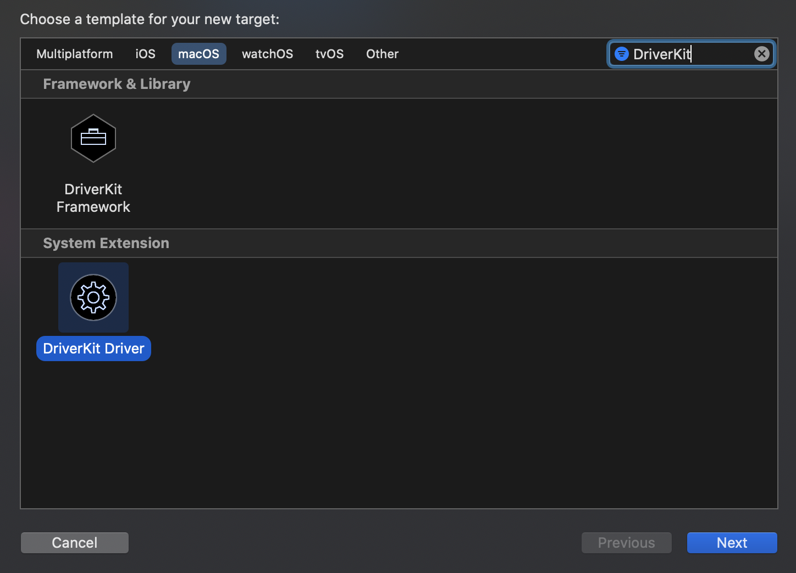

# :mage: Інструкція з написання драйверів для MacOS
Семестровий проєкт з курсу Операційних систем в УКУ.

*Обережно: інструкція незавершена.*

### :uk: Для перегляду англійської версії перейдіть за наступним [посиланням](README.md)

# Інструкція:
Давайте розпочнемо і увійдемо в чарівний світ створення драйверів, і may the force be with You.

## Анотації:
*незабаром...*

## Поняття та акроніми:
* **Dext** – розширення драйвера.
* **Kext** – розширення ядра.
* **SDK** – Комплект розробки програмного забезпечення.
* **HID** – стандарт human interface device.

## Вступ у світ драйверів:
По суті, драйвер — це специфічний код, який керує відповідним пристроєм введення-виведення, підключеним до комп’ютера [2].
Іншими словами, драйвери можна розглядати як міст між периферійними пристроями комп’ютера та рештою системи. [3]
Отже, це засіб комунікації та контролю.
 
«Сучасні операційні системи» Ендрю Таненбаума [2] надають хороший огляд драйверів, які запускаються в просторі ядра, 
але в цій інструкції ми здебільшого зосередимося на драйверах, які запускаються в просторі користувача.

## Деталі завдання для macOS:
Як сказано в роботі Аміта Сінгха «Mac OS X Internals. A Systems Approach» [1], 
хоч зазвичай написання драйверів можна вважати важкою задачею, 
архітектура драйвера macOS є доволі корисною в цьому плані. 
Однією з основних переваг є те, що вона підтримує драйвери в просторі користувача 
(важливість чого ми обговоримо трохи пізніше –– у розділі про DriverKit).

У згаданій вище книзі наведено чудовий огляд архітектури драйверів і опис самого завдання їх написання для систем macOS.
В цю інструкцію я додала деякі деталі, які можуть бути важливими для розуміння, коли тільки починаєш працювати
з драйверами загалом і драйверами macOS зокрема.

Зазвичай типові системи Unix використовують спеціальні файли пристрою (які зазвичай знаходяться в директорії /dev/)
для інтерфейсу комунікації користувача з пристроями. Новіші системи (включаючи macOS) ще й динамічніше керують пристроями ––
вони дозволяють динамічно створювати або видаляти (і автоматично призначати) ці файли пристроям.
macOS надає ці файли для пристроїв зберігання даних, послідовних (serial) пристроїв, псевдотерміналів і деяких псевдопристроїв.

*більше інформації пізніше...*

## Інструменти для macOS:
У цій інструкції ми обговоримо два можливі варіанти щодо вибору інструментів при написанні драйверів для
системи macOS. Перший – це I/O Kit – набір бібліотек фреймворків, інструментів та інших ресурсів для
створення драйверів пристроїв, а другий – DriverKit – модернізована заміна I/O Kit.

## Детальніше про I/O Kit:
I/O Kit — це набір програмного забезпечення як на рівні ядра, так і на рівні користувача, 
який використовується як спрощений засіб для написання драйверів. 
I/O Kit також координує використання драйверів пристроїв. [1]

Під час написання драйверів для macOS за допомогою I/O Kit драйвери, по суті, є об’єктами I/O Kit, який керує певним
частина обладнання. [1] 

## Більше про DriverKit:
*Інформацію про DriverKit отримано з офіційної презентації, доступної на
за посиланням (https://developer.apple.com/videos/play/wwdc2019/702/) і в
[офіційній документації](https://developer.apple.com/documentation/driverkit).*

DriverKit — це SDK, який був представлений під час Worldwide Developers Conference у 2019 році разом із System Extensions. 
Усі фреймворки DriverKit засновані на I/O Kit, але вони були модернізовані, щоб бути більш надійними,
безпечними та зручнішими для розробки. 
DriverKit використовується для створення розширень драйверів (dexts -- driver extensions) у просторі користувача.

Тепер розширення драйверів, створені за допомогою DriverKit, замінюють драйвери створені з I/O Kit.

Ці драйвери використовуються для управління наступними приладами:
* USB
* Послідовними (serial)
* NIC (Network Interface Controller)
* HID (Human Interface Device)

Як описано у відео за наступним [посиланням](https://developer.apple.com/videos/play/wwdc2019/702/)
є кілька переваг використання System Extensions і DriverKit:
* На відміну від kexts, системні розширення виконуються в просторі користувача, помилки в них не можуть пошкодити ядру
* Системні розширення не мають обмежень щодо динамічного розподілу пам'яті, синхронізації та затримки
* Білд, тестування та дебаг можна виконувати на одній машині
* Увімкнено повну підтримку дебагеру
* Тепер немає необхідності перезапускати машину, якщо розширення ламається
* Ядро та інші програми не зупиняться, якщо розширення зламається
* DriverKit забезпечує повну сучасну заміну попередньо обговорюваного I/O Kit
* Драйвери DriverKit працюють у просторі користувача, де, як і System Extensions, вони не можуть нести небезпеки для ядра
* Ці розширення доступні всім користувачам, навіть для завдань, які раніше виконували лише kexts
* І так далі і тому подібне

Крім того, починаючи з нових версій macOS, kexts будуть ваважати застарілими.
Це [офіційно зазначено] (https://developer.apple.com/documentation/iokit/) на веб-сайті розробників Apple,
що пристрої, які підтримуються для macOS 11 (і новіших версій), потребують DriverKit замість I/O Kit.

Ми спробуємо цей новий, безпечніший і, можливо, простіший підхід – фреймворк DriverKit.

---

## Створення драйверів з DriverKit:
*Ця –– перша версія інструкції –– базується на
[офіційній інструкції](https://developer.apple.com/documentation/driverkit/creating_a_driver_using_the_driverkit_sdk) [3]
для написання драйверів за допомогою DriverKit SDK та зразка коду [5].*

## Початок:
Щоб розпочати проєкт, ми створимо його в Xcode, який надає базовий шаблон для створення драйверів DriverKit.

Ми додамо драйвер до вже існуючого проєкту, оскільки драйвери, створені за допомогою DriverKit, 
вимагають застосунку (Swift app наприклад), який встановить ці драйвери та використовуватиме їх.

Почніть зі створення нової програми в Xcode:


P.S. Ви можете вибрати іншу назву, якій ви віддаєте перевагу, та вказати ідентифікатор вашої організації.

Ми використаємо Swift для написання застосунку (сам драйвер буде написаний на C++), як в офіційній документації:


Тепер ми додамо драйвер до проекту:


Виберіть драйвер DriverKit:



Виберіть опції:


Тепер ви зможете побачити дещо схоже вікно:


Вітаю! Ми *майже* закінчили.

## Білд проекту:
Давайте спробуємо створити базовий драйвер клавіатури, використовуючи шаблон, який ми щойно отримали, 
і в той же час дослідити його.
Для цього завдання ми будемо використовувати частини коду з офіційної документації Apple [3].

По-перше, що саме ми маємо в шаблоні для створення драйвера? Подивіться на директорію,
яка називається так само, як і сам проект:


* ***.cpp** –– це файл із основним вихідним кодом C++.
* ***.iig** –– це файл-заголовок генератора інтерфейсу IOKit.
* ***.entitlements** –– є файлом entitlements (прав) за замовчуванням. Ми обговоримо, що таке entitlements (права)
і як заповнити цей файл у наступному розділі.
* ***.plist** –– це файл із конкретною інформацією для підтримки завантаження та встановлення драйвера.

Давайте почнемо перегляд коду пристрою клавіатури з документації.
По-перше, давайте перевіримо вміст файлу *.iig (DriverExample.iig у моєму випадку):
```c++
#ifndef DriverExample_h
#define DriverExample_h

#include <Availability.h>
#include <DriverKit/IOService.iig>

class DriverExample: public IOService
{
public:
    virtual kern_return_t
    Start(IOService * provider) override;
};

#endif /* DriverExample_h */
```
Код буде виглядати якось так. *(Зверніть увагу, що ця інформація є актуальною на 13 листопада 2021 року,
і можуть відбутися незначні зміни API в тому тисячоліття, в якому ви зараз живете)*

Тут ```IOService``` –– це базовий клас усіх драйверів. Ми можемо продовжувати з ним працювати, але було б краще
працювати з чимось більш конкретним. Існують різні сімейства класів, надані DriverKit, і для нашого випадку
ми виберемо клас для обробки подій HID. Чому саме HID (Human Interface Device)? Це тому, що клавіатура належить
до таких пристроїв, і ми хочемо, щоб клас якимось чином отримував інформацію про те, що з ним відбувається. 
Конкретний клас, який ми виберемо замість базового -– ```IOUserHIDEventService```.

Ось як зараз має виглядати клас у вашому файлі *.iig (плюс нові додаткові інклюди):
```c++
#include <HIDDriverKit/IOUserHIDEventService.iig>

class DriverExample: public IOUserHIDEventService
{
public:
    virtual kern_return_t
    Start(IOService * provider) override;
};
```

Нам також потрібно буде реалізувати кілька init та free методів, тому ми також додамо їх до файлу-заголовку.
Ось як тепер має виглядати весь файл:
```c++
#ifndef DriverExample_h
#define DriverExample_h

#include <Availability.h>
#include <DriverKit/IOService.iig>
#include <HIDDriverKit/IOUserHIDEventService.iig>

class DriverExample: public IOUserHIDEventService
{
public:
    virtual bool init() override;
    virtual void free() override;
    
    virtual kern_return_t
    Start(IOService * provider) override;
};

#endif /* DriverExample_h */
```

Тепер перейдемо до нашого основного файлу вихідного коду – вашого файлу *.cpp (DriverExample.cpp у моєму випадку). 
Наразі він має виглядати так:
```c++
#include <os/log.h>

#include <DriverKit/IOUserServer.h>
#include <DriverKit/IOLib.h>

kern_return_t
IMPL(DriverExample, Start)
{
    kern_return_t ret;
    ret = Start(provider, SUPERDISPATCH);
    os_log(OS_LOG_DEFAULT, "Hello World");
    return ret;
}
```

