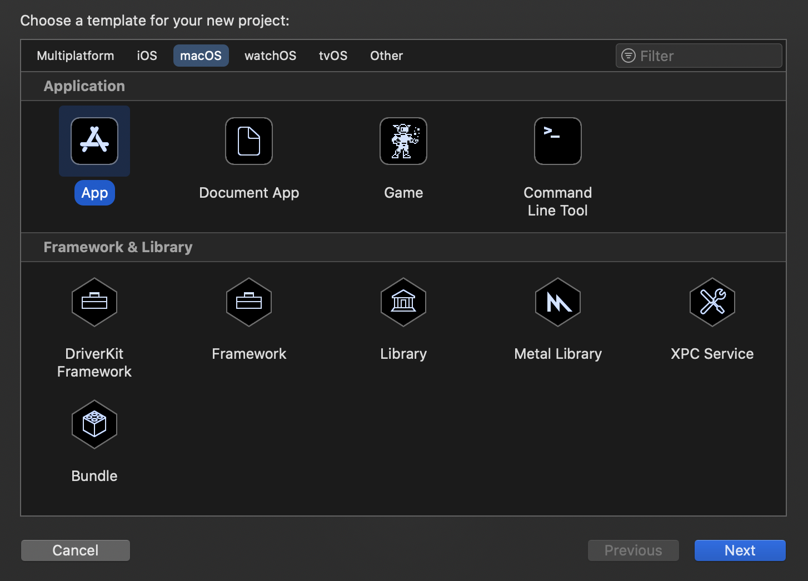
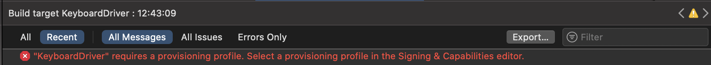

# :mage: Інструкція з написання драйверів для MacOS
Семестровий проєкт з курсу Операційних систем в УКУ (Український Католицький Університет).

*Попередження: в інструкції не вистачає практичних прикладів для встановлення та дебагу.*

### :uk: Для перегляду англійської версії перейдіть за наступним [посиланням](README.md)

---
## Зміст
1. [Introduction](#introduction)
    1. [Acronyms](#acronyms)
    1. [Introduction to drivers](#introduction-to-drivers)
    1. [Details on the task for macOS](#details-on-the-task-for-macos)
1. [macOS tools](#macos-tools)
    1. [More about I/O kit](#more-about-io-kit)
    1. [More about DriverKit](#more-about-driverkit)
1. [Drivers using DriverKit framework –– about](#drivers-using-driverkit-framework--about)
    1. [How dext works in the system](#how-dext-works-in-the-system)
    1. [Creating driver extension](#creating-driver-extension)
    1. [Apps and system extensions relationship](#apps-and-system-extensions-relationship)
    1. [Classes in DriverKit](#classes-in-driverkit)
    1. [Restriction of the C++ subset](#restriction-of-the-c-subset)
    1. [Entitlements](#entitlements)
    1. [Info.plist and matching](#infoplist-and-matching)
    1. [Basic development steps](#infoplist-and-matching)
1. [Drivers using DriverKit framework –– example](#drivers-using-driverkit-framework--example)
    1. [Starting](#starting)
    1. [Building up the project](#building-up-the-project)
    1. [Installing Your driver](#installing-your-driver)
    1. [Debug](#debug)
1. [Additionaly](#additionaly)
1. [Sources/literature](#sourcesliterature)


# :coffee: Інструкція:
Давайте розпочнемо та відправимось в чарівний світ створення драйверів, і may the force be with You.

---
*Ця інструкція в більшості створена на основі
[офіційних настанов](https://developer.apple.com/documentation/driverkit/creating_a_driver_using_the_driverkit_sdk) [3]
для написання драйверів з DriverKit SDK, DriverKit документації на [Apple Developer вебсайті](https://developer.apple.com/documentation/driverkit) та зразках коду [5].* 

---
## Вступ:
Перед тим як перейти до більш конкретних інструментів та прикладів, давайте пройдемось по кільком визначенням та коротким деталям про дравери та їх розробку.

### Акроніми:
* **Dext** – розширення драйвера (driver extension)
* **Kext** – розширення ядра (kernel extension)
* **SDK** – Комплект розробки програмного забезпечення (Software Development Kit)
* **HID** – стандарт human interface device.
* **API** - прикладниий програмний інтерфейс (Application Programming Interface)
* **I/O** - Ввід / Вивід (Input / Output)
* **NIC** - мережева плата (Network Interface Controller)
* **USB** - універсальна послідовна шина (Universal Serial Bus)
* **IIG** - генератор інтерфейсу I/O Kit (I/O Kit Interface generator)
* **RTTI** - динамічна ідентифікація типу (runtime type information)
* **PCI** -  взаємозв'язок периферійних компонентів, якщо дослівно (Peripheral Component Interconnect)
* **SIP** - захист цілісності системи (System Integrity Protection)
* **plist** - список властивостей (property list)

**Декілька визначень:**
* **драйвер** - код/програма для контролю пристрою (хардвару).
* **nub (вузол)** – об'єкт, який представляє канал зв'язку для девайсу. (більше [тут](https://developer.apple.com/library/archive/documentation/DeviceDrivers/Conceptual/IOKitFundamentals/ArchitectOverview/ArchitectOverview.html#//apple_ref/doc/uid/TP0000013-BEHDCDDC)) 

### Вступ у світ драйверів:
По суті, драйвер — це специфічний код, який керує відповідним йому пристроєм вводу-виводу, підключеним до комп’ютера [2].
Іншими словами, драйвери можна розглядати як міст між периферійними пристроями комп’ютера та рештою системи. [3]
Отже, це засіб комунікації та контролю.
 
«Сучасні операційні системи» Ендрю Таненбаума [2] надають хороший огляд драйверів, які запускаються в просторі ядра, 
але в цій інструкції ми здебільшого зосередимося на драйверах, які запускаються в просторі користувача.

Якщо Ви б хотіли проглянути I/O Реєстр ([I/O Registry](https://developer.apple.com/library/archive/documentation/DeviceDrivers/Conceptual/IOKitFundamentals/TheRegistry/TheRegistry.html)) (він містить динамічне "дерево" з вузлами та драйверами) Вашої системи, Ви можете запустити наступну команду в терміналі: ```ioreg```.

### Деталі завдання для macOS:
Як сказано в роботі Аміта Сінгха «Mac OS X Internals. A Systems Approach» [1], 
хоч зазвичай написання драйверів можна вважати важкою задачею, 
архітектура драйвера macOS є доволі корисною в цьому плані. 
Однією з основних переваг є те, що вона підтримує драйвери в просторі користувача 
(важливість чого ми обговоримо трохи пізніше –– у розділі про DriverKit).

У згаданій вище книзі наведено чудовий огляд архітектури драйверів і опис самого завдання їх написання для систем macOS.
В цю інструкцію я додала деякі деталі, які можуть бути важливими для розуміння, коли тільки починаєш працювати
з драйверами загалом і драйверами macOS зокрема.

Зазвичай типові системи Unix використовують спеціальні файли пристрою (які зазвичай знаходяться в директорії /dev/)
для інтерфейсу комунікації користувача з пристроями. Новіші системи (включаючи macOS) ще й динамічніше керують пристроями ––
вони дозволяють динамічно створювати або видаляти (і автоматично призначати) ці файли пристроям.
macOS надає ці файли для пристроїв зберігання даних, послідовних (serial) пристроїв, псевдотерміналів і деяких псевдопристроїв.

---
## Інструменти для macOS:
У цій інструкції ми обговоримо два можливі варіанти щодо вибору інструментів при написанні драйверів для
системи macOS. Перший – це I/O Kit – набір бібліотек фреймворків, інструментів та інших ресурсів для
створення драйверів пристроїв, а другий – DriverKit – модернізована заміна I/O Kit.

### Детальніше про I/O Kit:
I/O Kit — це набір програмного забезпечення як на рівні ядра, так і на рівні користувача, 
який використовується як спрощений засіб для написання драйверів. 
I/O Kit також координує використання драйверів пристроїв. [1]

Під час написання драйверів для macOS за допомогою I/O Kit драйвери, по суті, є об’єктами I/O Kit, який керує певним
частина обладнання. [1] 

### Більше про DriverKit:
*Інформацію про DriverKit отримано з офіційної презентації, доступної на
за посиланням (https://developer.apple.com/videos/play/wwdc2019/702/) і в
[офіційній документації](https://developer.apple.com/documentation/driverkit).*

DriverKit — це SDK, який був представлений під час Worldwide Developers Conference у 2019 році разом із System Extensions. 
Усі фреймворки DriverKit засновані на I/O Kit, але вони були модернізовані, щоб бути більш надійними,
безпечними та зручнішими для розробки. 
DriverKit використовується для створення розширень драйверів (dexts -- driver extensions) у просторі користувача.

Тепер розширення драйверів, створені за допомогою DriverKit, замінюють драйвери створені з I/O Kit.

Ці драйвери використовуються для управління наступними приладами:
* USB
* Послідовними (serial)
* NIC (Network Interface Controller)
* HID (Human Interface Device)

Як описано у відео за наступним [посиланням](https://developer.apple.com/videos/play/wwdc2019/702/)
є кілька переваг використання System Extensions і DriverKit:
* На відміну від kexts, системні розширення виконуються в просторі користувача, помилки в них не можуть пошкодити ядру
* Системні розширення не мають обмежень щодо динамічного розподілу пам'яті, синхронізації та затримки
* Білд, тестування та дебаг можна виконувати на одній машині
* Увімкнено повну підтримку дебагеру
* Тепер немає необхідності перезапускати машину, якщо розширення ламається
* Ядро та інші програми не зупиняться, якщо розширення зламається
* DriverKit забезпечує повну сучасну заміну попередньо обговорюваного I/O Kit
* Драйвери DriverKit працюють у просторі користувача, де, як і System Extensions, вони не можуть нести небезпеки для ядра
* Ці розширення доступні всім користувачам, навіть для завдань, які раніше виконували лише kexts
* І так далі і тому подібне

Крім того, починаючи з нових версій macOS, kexts будуть ваважати застарілими.
Це [офіційно зазначено] (https://developer.apple.com/documentation/iokit/) на веб-сайті розробників Apple,
що пристрої, які підтримуються для macOS 11 (і новіших версій), потребують DriverKit замість I/O Kit.

Ми спробуємо цей новий, безпечніший і, можливо, простіший підхід – фреймворк DriverKit.

---
## Створення драйверів з DriverKit –– опис:
У цій частині ми продовжимо обговорення DriverKit, але більш детально. Отже, в DriverKit Dext (Розширення драйвера) –– це системне розширення, яке керує хардвером і доступне для всієї системи. Є навіть деякі драйвери DriverKit, які надаються разом із Catalina, тож, незважаючи на те, що цей набір є досить новим, він перевірений та офіційно використовується розробниками системи Catalina. 

### Як dext'и працюють в системі:
Як уже було сказано, dext'и працюють у просторі користувача, тому організація їх роботи дещо відрізняється від розширень ядра. Якщо коротко, коли з’являється пристрій (для якого ми створили або вже маємо розширення драйвера), I/O Kit matching (яке вже вже наявне в системі) створює службу ядра, яка представляє Вашу службу. Потім система запускає процес для драйвера (наприклад, написаного Вами). Для кожного пристрою буде створюватися новий екземпляр драйвера  (тому для кожного з них буде запущено новий процес).

Більш детальна інформація на цю тему наявна у відео-презентації [4] DriverKit приблизно з 12-ї хвилини.

### Створення драйвера:
Як було сказано раніше, DriverKit API заснований на [I/O Kit API](https://developer.apple.com/library/archive/documentation/DeviceDrivers/Conceptual/IOKitFundamentals/Introduction/Introduction.html#/ /apple_ref/doc/uid/TP0000011-CH204-TPXREF101). Цей новий, DriverKit API, обмежений, він **не має прямого доступу** до файлової системи, мережі та IPC. Деякі з його класів засновані на відповідних класах I/O Kit, деякі є абсолютно новими (для отримання додаткової інформації відвідайте розділ [Класи в DriverKit](#classes-in-driverkit)).

Щоб створити проект для dext, Ви можете використати шаблон із Xcode. Це стане чудовою відправною точкою для розвитку Вашого драйверу.

У DriverKit використовуються класи для розробки. Отже, щоб почати створювати драйвер, ми повинні визначити його клас. Існує спеціальний файл, який містить визначення класу для драйвера. Це файл **.iig**, в ньому описаний інтерфейс драйвера. Такі файли обробляються інструментом IIG (I/O Kit Interface Generator). Цей файл складається із класу зі стандартними типами C/C++ і визначеннями структури (хоча він має деякі нові атрибути для черг відправлення та обміну повідомленнями, які дозволяють спілкуватися з іншими адресними просторами), і він компілюється за допомогою компілятора Clang.

Базове визначення класу потребую перевизначення наступних методів (хоча найпростіший вміст файлу .iig із шаблону Xcode містить лише метод Start, тому ці інші не є обов’язковими, але все ще потрібні в більшості випадків):
```
{
    init()
    
    Start()
    
    Stop()
    
    free()
}
```

Приклад оголошення класу:
```c++
class ExampleDriver: public IOService
{
public:
    virtual bool init() override;
    
    virtual kern_return_t Start(IOService * provider) override;
    
    virtual kern_return_t Stop(IOService * provider) override;
    
    virtual void free() override;
    
};
```

Залежно від пристрою, для якого Ви пишете драйвер, Ви зможете використовувати різні сімейства драйверів, отже, Вам потрібно буде реалізувати більш конкретні та специфічні методи. Наприклад, якщо ви хочете написати драйвер для клавіатури, вам потрібно буде використовувати фреймворк HIDDriverKit і написати додаткові методи, такі як parseKeyboardElement, handleKeyboardReport тощо. Зазвичай вони мають макрос LOCALONLY, що означає, що вони запускатимуться лише локально в просторі процесу цього драйверу.

Отже, різні сім’ї мають різні визначення та реалізації класів.

Перейдемо до реалізацій: реалізація методів класу міститься у файлі **.cpp** з такою ж назвою, що й ваш проєкт (і з такою ж назвою, що і файл .iig). Тут Ви реалізуєте методи, визначені до цього. Але спочатку Вам потрібно буде визначити структуру з визначеннями змінних екземпляра. Це будуть змінні, пам'ять для яких буде виділена під час ініціалізації.

Ось невеличкий приклад того, як може виглядати подібна структура:
```c++
struct ExampleDriver_IVars
{
    OSBoolean example_variable1;
    
    OSString example_variable2;
};
```
Для якогось складнішого пристрою (наприклад, клавіатури) вам знадобляться змінні, які будуть утримувати елементи клавіатури в OSArray, тощо. Якщо коротко, різні сімейства –– потребують різних змінних.

Тепер, переходячи до реалізацій методів, ось що робить кожен метод (не включаючи методи, специфічні для різних пристроїв і сімейств):
1. init() – тут має бути виділена пам’ять для змінних екземпляру (тут Ви виділяєте структуру ..._IVars)
2. free() - звільнює пам'ять, виділену під час init()
3. Start() - запускає сервіс, перевіряє та метчить постачальника з сервісом, налаштовує структури даних, налаштовує пристрій, використовує інші кастомні методи, тощо
4. Stop() - скасовує все, що зробив Start()

Щоб встановити Ваш dext, Вам також знадобиться додаток (App) для його активації (докладніше про це в розділі нижче).

Крім того, щоб запустити свої драйвери, Вам знадобляться entitlements (права) (докладніше про них у розділі [Права Entitlements](#entitlements)), але для дебагу ви можете пропустити цей крок. Крім того, для створення системного розширення Вам потрібен Developer ID (докладніше про це у розділі [Додатково](#additionally)). Для розповсюдження розширення має бути підписане сертифікатом Ваших додатків і також воно має бути нотаріально завірене (докладніше про нотаріальне завірення [тут](https://developer.apple.com/documentation/security/notarizing_macos_software_before_distribution)).

Вам також потрібно підготувати файл Info.plist, оскільки він містить список властивостей і серед властивостей є ключ, який бере участь під час метчінгу пристроїв (докладніше про це в [Info.plist і метчінг](#infoplist-and-відповідність) розділі).

Тепер залишається лише створити додаток і запустити його. Після активації життєвим циклом драйвера буде керувати система. Тоді ви зможете дізнатися id його процесу за допомогою ```ps -ax | grep -i myuser``` і дебажити драйвер за допомогою команди ```sudo lldb```.

Для отримання інформації про дебаг та локальну розробку (з вимкненим SIP) можете відвідати розділ [Debug](#debug), який є частиною інструкції з прикладом/кейс-стаді.

### Взаємозв'язок застосунків і системних розширень:
Кожне системне розширення (включаючи dext'и, які нас найбільше цікавлять) постачається разом з додатком (застосунком/App). Драйвер належить до комплекту цього застосунку, тому користувач може встановити застосунок, щоб встановити створене Вами системне розширення. Отже, драйвери поширюються разом із додатками (для цього потрібно мати Developer ID, докладніше про це в розділі [Додатково](#additionally)).

Виклик методу ```activationRequest``` робить розширення доступним. Його можна активувати під час запуску програми, але це не обов’язково. Наприклад, Ваша програма може мати певну взаємодію з користувачем перед встановленням розширення (вона може запитати дозвіл користувача, тощо). З моменту активації життєвим циклом розширення драйвера керуватиме сама система. Це, наприклад, означає, що dext запуститься в той момент, коли це необхідно –– коли відповідний пристрій підключено до системи, тощо.

У прикладі, доступному в репозиторії, є приклад застосунку, написаного на Swift.

Крім того, розширення йде окремим пакетом від Вашого додатку (навіть якщо воно вбудоване в нього), тому воно має окремий Info.plist (докладніше про нього в розділі [Info.plist та метчінг](#infoplist-and-matching)) і є окремим таргетом в Xcode. Драйвери — це плоскі пакети (як Ви побачите, у них немає папки "contents").

Підсумовуючи, щоб встановити драйвер, Вам не потрібен інсталятор або додатковий пакет – драйвер вже буде частиною вашого пакету програми.

### Класи в DriverKit:
DriverKit використовує різні класи для розробки драйверів. Є класи для самих драйверів, для операцій з пам’яттю, черг, переривань, таймерів тощо.

Класи в DriverKit є або замінниками відповідних класів з I/O Kit, подібними до них, або абсолютно новими.

Ось кілька прикладів таких класів:
1. Подібні до I/O Kit:
    * IOService
    * IOMemoryDescriptor
    * IOBufferMemoryDescriptor
    * і інші...
2. Замінюють інші класи з I/O Kit:
    * IODispatchQueue
    * IOInterruptDispatchSource
    * IOTimerDispatchSource
    * IODispatchQueue::DispatchSync
    * IODispatchQueue::DispatchAsync
    * і інші...
3. Повністю нові класи:
    * OSAction
    * і інші...

Більше класів [тут](https://developer.apple.com/documentation/driverkit).

Трохи про деякі функції/значення класів:
* IOService є одним з основних класів у комплекті, це базовий клас для вашого драйвера, він має API подібне до I/O Kit: Start/Stop/Terminate.
* IODispatchQueue важливий, оскільки всі методи викликаються в черзі, а драйвери керують своїми власними чергами.
* IODispatchQueue, IOInterruptDispatchSource, IOTimerDispatchSource, IODispatchQueue::DispatchSync, IODispatchQueue::DispatchAsync також використовуються для обробки подій.
* Клас OSAction (для представлення поінтера на C функцію) інкапсулює виклик з I/O Kit API.
* тощо

DriverKit підтримує різні сімейства пристроїв, які надають абстракції різних пристроїв (тоді як IOService представляє всі пристрої). Отже, існують різні фреймворки для різних сімей, наприклад:
* NetworkingDriverKit ([посилання](https://developer.apple.com/documentation/networkingdriverkit))
* HIDDriverKit ([посилання](https://developer.apple.com/documentation/hiddriverkit)) (використовується в прикладі з клавіатурою)
* USBDriverKit ([посилання](https://developer.apple.com/documentation/usbdriverkit))
* USBSerialDriverKit ([посилання](https://developer.apple.com/documentation/usbserialdriverkit))
* SerialDriverKit ([посилання](https://developer.apple.com/documentation/serialdriverkit))
* PCIDriverKit ([посилання](https://developer.apple.com/documentation/pcidriverkit))

З огляду на їх функціонал, різні сімейства мають різні визначення та реалізації класів.

### Обмеження підмножини C++:
Як описано в [документації](https://developer.apple.com/library/archive/documentation/DeviceDrivers/Conceptual/IOKitFundamentals/Features/Features.html#//apple_ref/doc/uid/TP0000012-TPXREF105) C++ обмежено для I/O Kit (тому при розробці драйвера можна використовувати лише певну підмножину мови). I/O Kit не дозволяє:
* винятки
* множинне успадкування
* шаблони
* RTTI (динамічну ідентифікацію типу)

Для DriverKit я не знайшла інформації з таких самих питань, але слід враховувати, що він створений на основі I/O Kit, тому він може мати такі ж обмеження (принаймні частину з них). З іншого боку, dext'и виконуються в користувацькому просторі, тому вони можуть не мати таких самих обмежень. У відео-презентації [4] було сказано, що DriverKit дозволяє динамічне виділення пам'яті (чого немає у розширеннях ядра), тому для нього такого обмеження немає. У ньому все ще обговорюються деякі обмеження. Наприклад, dext'и повинні працювати ізольовано від решти системи, тощо.

Інші обмеження, які обговорювалися раніше, це обмеження API: немає прямого доступу до файлової системи, мережі та IPC.

Крім того, мова за замовчуванням для DriverKit API — це C++17.

### Права (entitlements)
Як один із заходів безпеки потрібні entitlements (права), вони оголошують можливості розширень.

Для того, щоб драйвер міг взаємодіяти з пристроями та сервісами, вам потрібно запросити
права на розробку DriverKit у Apple.

Система завантажує лише драйвери, які мають валідний набір прав, тому без них неможливо розробити повний продукт.
Права DriverKit дають вашому драйверу дозвіл працювати як драйвер (перепрошую за тавтологію) і визначають тип обладнання, 
яке підтримує ваш драйвер.

Щоб виконати інсталяцію драйвера, ваша програма повинна мати права для System Extensions.  Якщо коротко, Вам необхідні такі види прав:
* com.apple.developer.driverkit (для всіх драйверів)
* право транспортування, щоб контролювати пристрій (вони індивідуальні для типів пристроїв, ось приклад для USB: com.apple.developer.driverkit.transport.usb)
* сімейні права (специфічні для різних сімей, ось приклад для HID: com.apple.developer.driverkit.family.hid.device)

Щоб подати запит на отримання цих прав:
1. Перейдіть на сторінку https://developer.apple.com/system-extensions/ і перейдіть за відповідним посиланням, щоб надіслати запит на отримання прав.
2. Подайте заявку на отримання прав DriverKit.
3. Надайте опис програм, які ви будете використовувати в проєкті.

Права розміщуються у файлі із роширенням ```.entitlements```.

### Info.plist та метчінг:
Файл Info.plit (список властивостей) містить опис використання розширення (що воно робить, чому користувач повинен його використовувати, тощо).
Також ключ IOKitPersonalities із файлу plist використовується для того, щоб система могла зрозуміти, для якого пристрою підходить цей драйвер.
Тобто, коли система шукає драйвер для певного пристрою,
вона перевірить, чи підходить інформація з цього файлу для пристрою, чи ні. Докладніше про це [тут](https://developer.apple.com/documentation/driverkit/creating_a_driver_using_the_driverkit_sdk) у розділах «Provide Version and Description Information» та «Specify Criteria for Matching Your Services Against Devices».

Крім того, для оновлення dext вам слід змінити версію в plist, щоб система зрозуміла, що драйвер потрібно оновити.

### Основні кроки розробки:
1. Створіть проєкт програми в Xcode.
1. Додайте до нього окремий таргет, для чого скористайтеся шаблоном DriverKit Driver з Xcode.
1. Виберіть, яке сімейство DriverKit найкраще підходить для вашого пристрою.
1. Доповність визначення класу у файлі .iig.
1. Визначте змінні екземпляра та реалізуйте методи з файлу .iig у файлі .cpp.
1. Отримайте права для вашого розширення та додайте їх до файлу .entitlements.
1. Заповніть файл Info.plist.
1. Створіть свій додаток і додайте до нього activationRequest.
1. Запустіть додаток.
1. Віддебажте/використовуйте dext.

\+ Вам потрібно буде отримати Developer ID або інший відповідний сертифікат для розробки драйверів.

---
## Створення драйверів з DriverKit –– приклад:
Приклад розробки DriverKit dext. Наступна інструкція надасть приклад створення драйвера клавіатури, повторить деяку інформацію з попередніх розділів для глибшого розуміння та надасть деяку нову інформацію.

### Початок:
Щоб розпочати проєкт, ми створимо його в Xcode, який надає базовий шаблон для створення драйверів DriverKit.

Ми додамо драйвер до вже існуючого проєкту, оскільки драйвери, створені за допомогою DriverKit, 
вимагають застосунку (Swift app наприклад), який встановить ці драйвери та використовуватиме їх.

Почніть зі створення нової програми в Xcode:




P.S. Ви можете вибрати іншу назву, якій ви віддаєте перевагу, та вказати ідентифікатор вашої організації.

Ми використаємо Swift для написання застосунку (сам драйвер буде написаний на C++), як в офіційній документації:


Тепер ми додамо драйвер до проекту:


Виберіть драйвер DriverKit:


Виберіть опції:


Тепер ви зможете побачити дещо схоже вікно:


Вітаю! Ми *майже* закінчили.

## Білд проекту:
Давайте спробуємо створити базовий драйвер клавіатури, використовуючи шаблон, який ми щойно отримали, 
і в той же час дослідити його.
Для цього завдання ми будемо використовувати частини коду з офіційної документації Apple [3].

По-перше, що саме ми маємо в шаблоні для створення драйвера? Подивіться на директорію,
яка називається так само, як і сам проект:


* ***.cpp** –– це файл із основним вихідним кодом C++.
* ***.iig** –– це файл-заголовок генератора інтерфейсу IOKit.
* ***.entitlements** –– є файлом entitlements (прав) за замовчуванням. Ми обговоримо, що таке entitlements (права)
і як заповнити цей файл у наступному розділі.
* ***.plist** –– це файл із конкретною інформацією для підтримки завантаження та встановлення драйвера.

Давайте почнемо перегляд коду пристрою клавіатури з документації.
По-перше, давайте перевіримо вміст файлу *.iig (DriverExample.iig у моєму випадку):
```c++
#ifndef DriverExample_h
#define DriverExample_h

#include <Availability.h>
#include <DriverKit/IOService.iig>

class DriverExample: public IOService
{
public:
    virtual kern_return_t
    Start(IOService * provider) override;
};

#endif /* DriverExample_h */
```
Код буде виглядати якось так. *(Зверніть увагу, що ця інформація є актуальною на 13 листопада 2021 року,
і можуть відбутися незначні зміни API в тому тисячоліття, в якому ви зараз живете)*

Тут ```IOService``` –– це базовий клас усіх драйверів. Ми можемо продовжувати з ним працювати, але було б краще
працювати з чимось більш конкретним. Існують різні сімейства класів, надані DriverKit, і для нашого випадку
ми виберемо клас для обробки подій HID. Чому саме HID (Human Interface Device)? Це тому, що клавіатура належить
до таких пристроїв, і ми хочемо, щоб клас якимось чином отримував інформацію про те, що з ним відбувається. 
Конкретний клас, який ми виберемо замість базового -– ```IOUserHIDEventService```.

Ось як зараз має виглядати клас у вашому файлі *.iig (плюс нові додаткові інклюди):
```c++
#include <HIDDriverKit/IOUserHIDEventService.iig>

class DriverExample: public IOUserHIDEventService
{
public:
    virtual kern_return_t
    Start(IOService * provider) override;
};
```

Нам також потрібно буде реалізувати кілька init та free методів, тому ми також додамо їх до файлу-заголовку.
Ось як тепер має виглядати весь файл:
```c++
#ifndef DriverExample_h
#define DriverExample_h

#include <Availability.h>
#include <DriverKit/IOService.iig>
#include <HIDDriverKit/IOUserHIDEventService.iig>

class DriverExample: public IOUserHIDEventService
{
public:
    virtual bool init() override;
    virtual void free() override;
    
    virtual kern_return_t
    Start(IOService * provider) override;
};

#endif /* DriverExample_h */
```

Тепер перейдемо до нашого основного файлу вихідного коду – вашого файлу *.cpp (DriverExample.cpp у моєму випадку). 
Наразі він має виглядати так:
```c++
#include <os/log.h>

#include <DriverKit/IOUserServer.h>
#include <DriverKit/IOLib.h>

kern_return_t
IMPL(DriverExample, Start)
{
    kern_return_t ret;
    ret = Start(provider, SUPERDISPATCH);
    os_log(OS_LOG_DEFAULT, "Hello World");
    return ret;
}
```

Для роботи з HID service нам потрібні ще деякі інклюди, тому давайте додамо їх:
```c++
#include <DriverKit/OSCollections.h>
#include <HIDDriverKit/HIDDriverKit.h>
```

Коли система створить екземпляр service class'у вашого драйвера, вона викличе метод init. Додамо код цього методу:
```c++
struct DriverExample_IVars
{
    OSArray *elements;
    
    struct {
        OSArray *elements;
    } keyboard;
};


bool DriverExample::init()
{
    if (!super::init()) {
        return false;
    }
    
    ivars = IONewZero(DriverExample_IVars, 1);
    if (!ivars) {
        return false;
    }
    
exit:
    return true;
}
```
(Цей код йде після ```#include "YouProjectName.h"``` і перед реалізацією Start)

Тут під час ініціалізації ми виділяємо місце для змінних драйвера ––
елементів і клавіатури (яка містить елементи) у нашому випадку
(тут Ви можете побачити змінні в структурі ```DriverExample_IVars```).

Отже, дотримуючись цього прикладу, вам потрібно буде визначити структуру зі змінними, які вимагає ваш драйвер і
і алокувати пам'ять для цієї структури в методі ```init()```.

Ми виділили змінні екземпляра для драйвера клавіатури, тому тепер нам потрібен метод для звільнення пам’яті від них
(подальші приклади коду взято з/базуються на коді з [5]):
```c++
void DriverExample::free()
{
    if (ivars) {
        OSSafeReleaseNULL(ivars->elements);
        OSSafeReleaseNULL(ivars->keyboard.elements);
    }
    
    IOSafeDeleteNULL(ivars, DriverExample_IVars, 1);
    super::free();
}
```

Цей метод ```free()``` буде викликано перед вивантаженням (unloading) нашого сервісу.

Тепер давайте почнемо імплементовувати наш метод ```Start```:
```c++
kern_return_t
IMPL(DriverExample, Start)
{
   kern_return_t ret;
    
   ret = Start(provider, SUPERDISPATCH);
   if (ret != kIOReturnSuccess) {
      Stop(provider, SUPERDISPATCH);
      return ret;
   }
   
   //
   // Here the code of the startup tasks will go
   //

   RegisterService();
    
   return ret;
}
```

Цей метод буде викликаний, коли система буде готова до обробки інформації з пристрою.

У цьому методі драйвер виконує всі різноманітні завдання запуску: ініціалізацію змінних, зміну налаштувань пристрою,
виділення пам'яті для буферів даних і так далі.

Тепер давайте додамо кілька початкових завдань до коду. Цей код базується на зразку з [5].
```c++
kern_return_t
IMPL(DriverExample, Start)
{
    kern_return_t ret;
    
    ret = Start(provider, SUPERDISPATCH);
    if (ret != kIOReturnSuccess) {
        Stop(provider, SUPERDISPATCH);
        return ret;
    }

    os_log(OS_LOG_DEFAULT, "Hello from Your first DriverKit driver!");
    
    ivars->elements = getElements();
    if (!ivars->elements) {
        os_log(OS_LOG_DEFAULT, "Failed to get elements");
        Stop(provider, SUPERDISPATCH);
        return kIOReturnError;
    }
    
    ivars->elements->retain();

    os_log(OS_LOG_DEFAULT, "The startup task is now finished.");
    
    RegisterService();
    
    return ret;
}
```

Щоб працювати з даними з клавіатури, вам також потрібно буде розпарсити аргументи після їх збереження. 
Зразок коду парсингу також доступний у [5].

Вітаю! Це (мабуть) ваш перший драйвер DriverKit! Хоча він насправді нічого не робить з даними
з клавіатури (він просто зберігає її) це, тим не менш, драйвер.
Але це не Кінець –– для того, щоб запустити цей драйвер, Вам потрібно виконати ще деякі кроки.

### Інсталяція драйвера:
*На основі вказівок та рекомендацій з [6].*

Тепер, коли у нас є власний невеличкий драйвер, ми, можливо, захочемо його протестувати та й використовувати. 
Для того, щоб зробити це, нам спочатку потрібно інсталювати та активувати наш драйвер.

Справа в тому, що всі драйвери надаються разом із застосунком, і для DriverKit наявність застосунку (програми) 
є обов’язковою умовою. Тому ми не встановлюємо драйвери просто так, ми встановлюємо їх із відповідної програми.

Надалі приклад стосуватиметься проєкту, наданого в якості зразку компанією Apple за наступним посиланням –– 
https://developer.apple.com/documentation/hiddriverkit/handling_keyboard_events_from_a_human_interface_device.

Приклад у [examples/HandlingKeyboardEventsFromAHumanInterfaceDevice](examples/HandlingKeyboardEventsFromAHumanInterfaceDevice)
надає повний код для програми, написаної на Swift, і код для драйвера (це частково обговорювалося раніше).

Тож давайте подивимося, яка частина програми пов’язана з запуском драйвера:
```
// Activate the driver.
let request = OSSystemExtensionRequest.activationRequest(forExtensionWithIdentifier: driverID, queue: DispatchQueue.main)
request.delegate = self
let extensionManager = OSSystemExtensionManager.shared
extensionManager.submitRequest(request)
```
Тут ви можете побачити ```activationRequest```, який ми обговорювали в попередніх розділах.

Ця частина коду використовується для активації вашого драйвера, і її можна знайти в 
[AppDelegate.swift](examples/HandlingKeyboardEventsFromAHumanInterfaceDevice/HIDKeyboardApp/AppDelegate.swift).

Тепер ви можете запустити свою програму та встановити драйвер.

Але що робити, якщо ви не маєте прав (entitlements) від Apple, але все одно хочете встановити драйвер?
Про це йтиметься в наступному розділі –– «Дебаг».

## Дебаг 
Якщо ви спробуєте встановити драйвер у «безпечному режимі» (з увімкненим SIP, загалом це має бути звичайний стан вашого комп'ютера)
без прав (entitlements), обговорюваних раніше, ви отримаєте таку помилку:



Ось чому, якщо ви не отримали прав і просто хочете потренуватися та відлагодити свій драйвер
(або системне розширення, їх це також стосується) Вам слід увійти в режим розробника та відключити SIP.
Щоб зробити це, виконайте наступні дії:

Щоб увімкнути режим розробника в терміналі, введіть таку команду:
```
systemextensionsctl developer on 
```

Тут може виникнути така проблема:


Це означає, що Ви маєте увімкнений SIP (захист цілісності системи).

Щоб вимкнути його, виконайте наступні кроки (зі статті [Вимкнення та ввімкнення захисту цілісності системи](https://developer.apple.com/documentation/security/disabling_and_enabling_system_integrity_protection)):

*(Хоча перед тим, як вимкнути SIP, я б рекомендувала створити так звану Машину Часу (Time Machine) та зберегти на зовнішньому носії.
Я рекомендую це з міркувань безпеки –– Ви можете забути знову ввімкнути SIP, і ваш комп’ютер, 
можливо, буде уразливим до шкідливого коду тощо)*

Спочатку увійдіть в режим Recovery. Щоб це зробити, натисніть COMMAND і R відразу під час увімкнення комп'ютера.
Після входу в режим Recovery перейдіть до утиліт і виберіть «Термінал». У цьому терміналі запустіть таку команду:
```
csrutil disable
```

Тепер перезапустіть комп'ютер, щоб зміни відбулися.

Тепер після входу в режим розробника ви повинні побачити таке повідомлення:


Тепер запуск програми не повинен бути проблемою, і ви зможете віддебажити драйвер.

*Важливо: наразі в моєму випадку виникла проблема з developer team, я використовую приватну команду і не можу створювати
драйвер навіть у режимі розробника, тому що для створення драйвера потрібен Developer ID, якого у мене немає. З огляду на це, наступні інструкції мають добре працювати в теорії (вони засновані на офіційних рекомендаціях з дебагу), але в них бракує практичних прикладів. Щоб дізнатися більше про отримання Developer ID для таких завдань, відвідайте розділ «Додатково».*

Якщо Ви хочете запустити програму з терміналу, ви можете спробувати наступним чином (запустити з диреторії, який містить
проєкт, наприклад [з цієї](examples/HandlingKeyboardEventsFromAHumanInterfaceDevice)):
```
/usr/bin/xcodebuild -target HIDKeyboardApp  -configuration Debug
```

Якщо є проблема із запуском xcode таким чином, ви можете спробувати такий фікс (воно використовуватиме програму Xcode):
```
sudo xcode-select -s /Applications/Xcode.app/Contents/Developer
```

Щоб перевірити список розширень (і, сподіваюся, побачити тут ваш драйвер) у терміналі, введіть таку команду:
```
systemextensionsctl list
```

Щоб налагодити вашу програму ([Налагодження та тестування системних розширень](https://developer.apple.com/documentation/driverkit/debugging_and_testing_system_extensions))
використовуйте lldb. Щоб отримати PID вашого процесу, використовуйте ```ps```. Запустіть lldb з терміналу та приєднайтесь до процесу ```process attach --pid```.
Тепер ви зможете віддебажити свою програму.

Після завершення не забудьте вийти з режиму розробника та **увімкнути SIP!**

Щоб вимкнути режим розробника, просто виконайте таку команду:
```
systemextensionsctl developer off
```

System Integrity Protection надзвичайно важливе, щоб гарантувати, що якийсь шкідливий код не пошкодить Вашу систему,
тому увійдіть у режим Recovery ще раз, увійдіть в Термінал та увімкніть SIP, виконавши таку команду:
```
csrutil enable
```

Тепер перезапустіть комп'ютер, щоб зміни були виконані.

Ось і все, тепер у вас і ваш застосунок, і драйвер, вони налагоджені та готові до подальших пригод.

---
## Додатково:
Щоб мати можливість створювати драйвер (і мати більший доступ до розробки macOS загалом), вам потрібно мати Developer ID. Без нього ви все одно можете розробляти програми (за допомогою вашого Apple ID у вас буде персональна команда розробника), але не ті, які працюють із системними розширеннями.

Щоб отримати сертифікат Developer ID (докладніше [тут](https://developer.apple.com/support/developer-id/)) вам потрібно податися на [Програму розробника Apple](https://developer. apple.com/programs/) (або Apple Developer Enterprise Program). Ось [посилання на реєстрацію](https://developer.apple.com/programs/enroll/), перевірте, який тип реєстрації вам потрібен, і перейдіть за посиланням унизу сторінки. Майте на увазі, що для цього вам все одно потрібен Apple ID, а вартість програми становить 99 доларів США (ціна на січень 2022 року).

---
## Джерела/література:
1. "MAC OS X Internals: A Systems Approach" by Amit Singh ([link](https://www.oreilly.com/library/view/mac-os-x/0321278542/))
2. Modern Operating Systems, Andrew S. Tanenbaum (mostly chapter 5) ([link](https://csc-knu.github.io/sys-prog/books/Andrew%20S.%20Tanenbaum%20-%20Modern%20Operating%20Systems.pdf))
3. [Creating a Driver Using the DriverKit SDK](https://developer.apple.com/documentation/driverkit/creating_a_driver_using_the_driverkit_sdk) 
4. [System Extensions and DriverKit video presentation](https://developer.apple.com/videos/play/wwdc2019/702/)
5. [Handling Keyboard Events from a Human Interface Device](https://developer.apple.com/documentation/hiddriverkit/handling_keyboard_events_from_a_human_interface_device)
6. [Installing System Extensions and Drivers](https://developer.apple.com/documentation/systemextensions/installing_system_extensions_and_drivers)
7. [DriverKit](https://developer.apple.com/documentation/driverkit)
8. [Implementing Drivers, System Extensions, and Kexts](https://developer.apple.com/documentation/systemextensions/implementing_drivers_system_extensions_and_kexts)
9. [Introduction to I/O Kit Fundamentals](https://developer.apple.com/library/archive/documentation/DeviceDrivers/Conceptual/IOKitFundamentals/Introduction/Introduction.html)
10. [Preparing the Development Team](https://developer.apple.com/library/archive/documentation/General/Conceptual/ApplicationDevelopmentOverview/CreateYourDevelopmentTeam/CreateYourDevelopmentTeam.html)
11. [Non-macOS driver template example (Oracle)](https://docs.oracle.com/cd/E36784_01/html/E36866/eqbof.html#scrolltoc)
12. [I/O Kit language choice](https://developer.apple.com/library/archive/documentation/DeviceDrivers/Conceptual/IOKitFundamentals/Features/Features.html#//apple_ref/doc/uid/TP0000012-TPXREF105)

## Підготувала:
* [Daria Omelkina](https://github.com/dariaomelkina)

Особлива подяка висловлюється всім в команді Apple, хто створив інструменти, про які йдеться в цій інструкції,
документацію для них і зразки коду, а також зробили все доступним в Інтернеті.
